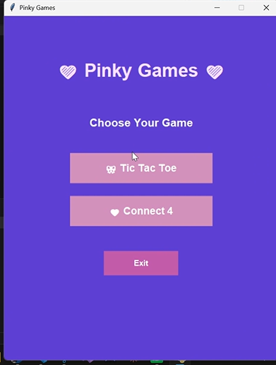

# Pinky Games

Pinky Games is a desktop application developed using Python and Tkinter. The project includes two classic games, Tic Tac Toe and Connect 4, with AI opponents.

## Games

### Tic Tac Toe

* Player vs AI
* Easy, Medium, and Hard difficulty levels
* Minimax algorithm for AI decision-making
* Win and draw detection
* Restart and Home navigation

### Connect 4

* Player vs AI
* Minimax with Alpha-Beta Pruning
* Animated falling pieces
* Win and draw detection
* Restart and Home navigation

## Technologies

* Python
* Tkinter
* Minimax Algorithm
* Alpha-Beta Pruning

## Features

* Interactive graphical user interface
* AI-based gameplay
* Multiple difficulty levels
* Game state management
* Win and draw detection
* Animated Connect 4 pieces
* Custom user interface

## Screenshots

<p align="center">
  
  
  
</p>

## How to Run

Make sure Python is installed on your machine.

Clone the repository:

```bash
git clone https://github.com/shahdomar555/Pinky_Gmaes.git
```

Navigate to the project directory:

```bash
cd Pinky_Gmaes
```

Run the application:

```bash
python pinky_games1.py
```

## Project Structure

```text
Pinky_Gmaes/
│
├── screenshots/
│   ├── home.png
│   ├── tic_tac_toe.png
│   └── connect4.png
│
├── pinky_games1.py
└── README.md
```
